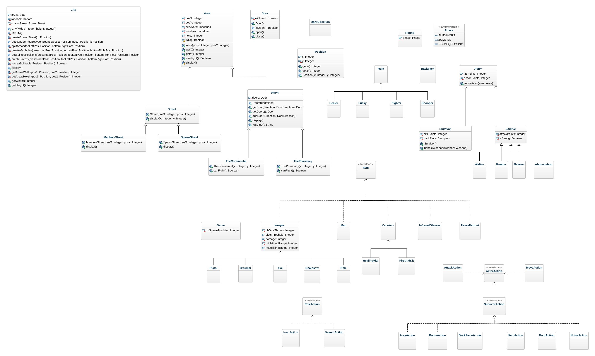
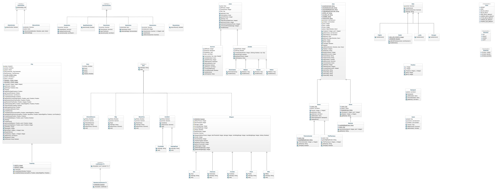

# l2s4-projet-2024

# Equipe

- Léo GIARDINELLI
- Théophane LEGRAND
- Dylan LEMAIRE
- Elies PLACIDE

# Sujet

[Le sujet 2024](https://www.fil.univ-lille.fr/~varre/portail/l2s4-projet/sujet2024.pdf)

# UML LIVRABLE 1


# UML LIVRABLE 2


# UML LIVRABLE 3


# UML LIVRABLE 4


# Livrables

## Livrable 1
### Objectif du premier livrable 
Travailler sur la modélisation de la map et créer un algorithme de création, créer un plateau d'entrainement.

### Choix de modélisation 
Dans un tout premier temps, il s'agissait de créer un plateau représentant la ville par des listes et de Streets et de Building.  
Après réflexion, on a vite compris que créer une classe Building serait inutile et que garder seulement les objets de type Room serait plus optimal.  
Nous avons également convenu qu'il serait préférable d'utiliser des tableaux pour modéliser la ville, comme le tp de BattleSHip réalisé au S3.    
Nous avons donc décidé d'ajouter dans un premier temps les rues tant que la ville pouvait être divisée en prenant en compte les contraintes imposées (un bâtiment doit faire au minimum 2 de largeur et longueur).  
Ensuite, il s'agissait de placer les pièces spéciales (Continental et Pharmacie), nous avons créé une méthode qui permettait de prendre une position aléatoire dans la ville et de vérifier si elle était null (pour éviter de tomber sur une steeet), puis donc de l'assigner à cette position.  
Enfin, nous avons rempli les zones vides par des Rooms qui sont ajoutée dans une liste de room.   
Cette liste va permettre en itérant dessus, de fermer les portes parmi toutes les positions (UP, DOWN, LEFT, RIGHT) car de bases, toutes les portes de toutes les cellules sont ouvertes.  
Ce qui donne l'affichage idéal de MiniCityMain (la ville d'entraînement).  

### Etat du développement 
- La modélisation de la carte est terminée avec en supplément l'ajout des portes.
- Test unitaire fonctionnel sur la modélisation de la map (à mettre a jour pendants l'intégration des acteurs et des items).  

### Atteinte des objectifs
- Modélisation de la carte est complète.
- Les portes ont été ajoutée avec succès.
- Les tests unitaires sur la modélisation de la map sont terminée.

### Ensemble des commandes 
- Compilation
```bash
javac -sourcepath src src/zombicide/*.java -d classes
```
- Exécution du programme (avec 2 paramètres longueur et largeur du tableau ou non, 10 par 10 de base)
```bash
java -classpath classes zombicide.Livrable2 10 10
```
pistol
- Tests compilation
```bash
javac -classpath junit-console.jar:classes test/zombicide/*.java
```

- Javadoc
```bash
javadoc -sourcepath src -subpackages zombicide -d docs
```

- Test exécution
```bash
java -jar junit-console.jar -classpath test:classes -scan-classpath
```

- Jar compilation
```bash
jar cvfe livrable1.jar zombicide/Main -C classes .
```
- Jar exécution
```bash
java -jar livrable1.jar 10 10
```


### Difficultés restant à résoudre
Aucune difficulté majeure n'a été identifiée jusqu'à présent.


## Livrable 2
### Objectif du premier livrable
- des choix de modélisation
- de l'état du développement
  
- un programme principal (nommé Livrable2.java)
  permettant de :
- créer la ville d'entraînement,
- placer un zombie (peu importe le type) sur chaque zone,
- créer un survivant de chaque rôle sur le carrefour principal,
- mettre une carte dans le sac à dos de chaque survivant,
- mettre dans la livrable2 de chaque survivant une fiole,
- afficher une représentation de la ville,
- déplacer tous les survivants d'une case vers le nord
- afficher sa représentation.

### Choix de modélisation
- Concernant les acteurs:
Nous avons remarqué que les survivants et les zombies avaient les points d'action et les points de vie en commun. Il s'agissait donc de créer une classe mère qui hérite des classes Survivor et Zommbie. Les types de Zombies seront des classes filles de la classe Zombie, avec des caractéristiques différentes selon le type de Zombie.  
Les rôles des joueurs seront gérés dans une liste de "rôles" présente dans la classe Survivor. La classe Rôle est donc une classe abstraite qui hérite différentes classes qui représentent les rôles disponibles.

- Concernant les équipements:
Nous avons décidé de créer une interface qui représentera les équipements. Nous avons ensuite "séparé" les types d'équipements en deux catégories principales: les armes et les autres. La classe Weapon est une classe abstraite 

### Etat du développement && Atteinte des objectifs
Tous les objectifs du livrable 2 ont été effectué, les zombies ont bien un type et ont été ajouté dans toutes les cellulles du plateau d'entraînement, tous les survivant avec un type de role on été ajouté dans la spawn du plateau d'entrainement et ont montés une cellulle.  
Ils ont tous une fiole dans les mains ainsi qu'une carte dans le sac à dos.
Nous avons donc implémenté les différents roles que peuvent avoir les survivants.  
Nous avons implémenté les déplacements dans toutes les directions des zombies et des survivants.
Nous avons aussi pu mettre des items dans la ville en les dispersants.

### Ensemble des commandes
- Compilation
```bash
javac -sourcepath src src/zombicide/*.java -d classes
```
```bash
javac -sourcepath src src/zombicide/actor/zombie/*.java -d classes
```
- Exécution du programme (avec 2 paramètres longueur et largeur du tableau ou non, 10 par 10 de base)
```bash
java -classpath classes zombicide.Livrable2 10 10
```

- Tests compilation
```bash
javac -classpath junit-console.jar:classes test/zombicide/*.java
```

- Javadoc
```bash
javadoc -sourcepath src -subpackages zombicide -d docs
```

- Test exécution
```bash
java -jar junit-console.jar -classpath test:classes -scan-classpath
```

- Jar compilation
```bash
jar cvfe livrable2.jar zombicide/Main -C classes .
```
- Jar exécution
```bash
java -jar livrable2.jar 10 10
```

### Difficultés restant à résoudre

## Livrable 3
Le placement des zombies sont sur les streets et non dans toutes les zines de la map, cela à été vu avec vous par mail.
### Objectif du troisième livrable 

- Travailler sur la modélisation des actions et leurs mises en place.
- Modéliser les actions

### Choix de modélisation
Pour le choix de modélisation des actions, nous avons premièrement créé une interface action ce qui nous permettra de mettre les méthodes communes de toutes les actions qui vont étendre de cette interface.  
Puis, nous avons fait le choix de séparer dans différents packages les actions communes (moveAction), les actions des survivants et les actions des zombies (AttackSurvivorAction), ce choix nous a permis d'avoir un meilleur visuel sur l'ensemble du sujet, bien évidemment, toutes ces actions étendent de l'interface action.  
Enfin, pour les actions spéciales, il s'agit en réalité d'actions qui sont des actions de survivants mais qui ont des spécificités, nous avons donc décidé de les mettre dans un package spécial.
Ces actions sont des rôles spécifiques qui sont réservés aux survivants et qui étendent de certaines actions. Il s'agit donc entre autre d'une spécification d'actions déjà existantes, qui réécrivent certaines méthodes pour les adapter à leur rôle.

### Etat du développement
Tous les objectifs du livrable 3 ont été complété
Récapitulatif des actions :
- Regarder autour de soi : Cette fonctionnalité est implémentée et est gratuite. Les joueurs peuvent obtenir une description de la zone où se trouve le survivant.
- Fouiller une pièce : Les survivants peuvent fouiller une pièce et récupérer des équipements s'ils en trouvent. La capacité du sac à dos est gérée, et les équipements non pris restent dans la pièce.
- Prendre en zombicide : Les joueurs peuvent prendre des objets de leur sac à dos pour les placer en zombicide, remplaçant ainsi tout objet déjà en zombicide.
- Utiliser un équipement : Les survivants peuvent utiliser les équipements qu'ils ont en zombicide, et les effets de chaque objet sont correctement appliqués. Une fois utilisé, l'équipement disparaît du jeu.
- Ouvrir une porte : Pour ouvrir une porte, les survivants doivent disposer de l'équipement approprié en zombicide. Ouvrir une porte fait apparaître des zombies, avec une chance d'apparition d'Abominations ou de Balaises.
- Faire du bruit : Les survivants peuvent choisir de faire du bruit pour attirer les zombies, augmentant ainsi le niveau de bruit dans leur zone.
- Se déplacer : Les survivants peuvent se déplacer vers une zone adjacente en passant par une porte ouverte.
- Attaquer un zombie : Les survivants peuvent attaquer les zombies en fonction de leur visibilité et de leur portée. Les attaques sont résolues en lançant des dés, avec des seuils de réussite et des dommages dépendant de l'arme utilisée. 

### Objectif atteint
- Toutes les actions spécifiées ont été implémentées
- La gestion des équipements, de la portée et des effets des actions est fonctionnelle.
- Lorsqu'un object est utilisé, il est correctement retiré du jeu

### Ensemble des commandes
- Compilation
```bash
javac -sourcepath src src/zombicide/*.java -d classes
```

```bash
javac -sourcepath src src/zombicide/actor/zombie/*.java -d classes
```

- Exécution du programme
```bash
java -classpath classes zombicide.Livrable3
```

- Tests compilation
```bash
javac -classpath junit-console.jar:classes test/zombicide/*.java
```
Cette commande devrait fonctionner mais elle ne fonctionne pas donc on a du compiler les tests dans chaque package
```bash
javac -classpath junit-console.jar:classes test/zombicide/action/survivor/*.java
```
```bash
javac -classpath junit-console.jar:classes test/zombicide/action/survivor/special/*.java
```
```bash
javac -classpath junit-console.jar:classes test/zombicide/action/zombie/*.java
```
```bash
javac -classpath junit-console.jar:classes test/zombicide/actor/*.java
```
```bash
javac -classpath junit-console.jar:classes test/zombicide/actor/action/*.java
```
```bash
javac -classpath junit-console.jar:classes test/zombicide/actor/survivor/*.java
```
```bash
javac -classpath junit-console.jar:classes test/zombicide/actor/survivor/backpack/*.java
```
```bash
javac -classpath junit-console.jar:classes test/zombicide/city/*.java
```
```bash
javac -classpath junit-console.jar:classes test/zombicide/city/area/*.java
```
```bash
javac -classpath junit-console.jar:classes test/zombicide/item/*.java
```
```bash
javac -classpath junit-console.jar:classes test/zombicide/util/listchooser/*.java
```

- Javadoc
```bash
javadoc -sourcepath src -subpackages zombicide -d docs
```

- Test exécution
```bash
java -jar junit-console.jar -classpath test:classes -scan-classpath
```

- Jar compilation
```bash
jar cvfe livrable3.jar zombicide/Livrable3 -C classes .
```

- Jar exécution
```bash
java -jar livrable3.jar
```

Ou utilisation du MakeFile

- Pour tout faire :
```bash
make all
```

- Pour compiler le projet :
```bash
make compile
```

- Pour exécuter les tests :
```bash
make test
```

- Pour générer la documentation :
```bash
make javadoc
```

- Pour créer un fichier JAR exécutable :
```bash
make jar
```

- Pour nettoyer les fichiers générés :
```bash
make clean
```

- Pour exécuter le fichier JAR généré : 
```bash
make run-jar ARGS="livrable3"
```

### Difficultés restant à résoudre

- Aucune difficulté majeure n'est signalée dans l'état actuel du développement.

## Livrable 4

### Objectif du quatrième livrable
Modélisation complète.

### Choix de modélisation
Nous avons donc tout mis en lien ce que nous avons fait dans les précédents livrables dans la classe game pour le déroulement du jeu.
Nous avons tout mis en place pour que le code soit ouvert à tout ajout futur tel que des actions, roles, types de survivants particuliers, types de zombies particuliers, types d'items particuliers, et autres ajouts possible.
En parti grâce à la généricité qui nous a permis de typer dynamiquement nos variables afin de respecter les consignes et de pouvoir ajouter des spécifications supplémentaires.
Le choix des packages à été réfléchis en groupe pour que ce soit le plus clair et concis possible afin que quelqu'un qui ne connait pas le projet puisse s'y retrouver au maximum.

### Etat du développement 
Le projet est réalisé et avec toutes les consignes demandé dans le sujet. Il fonctionne correctement.

### Atteinte des objectifs
Tous les objectifs ont été atteint.

### Difficultés restant à résoudre
Aucune.

# Journal de bord

## Semaine 1
Together, we created our first version of the UML with all the classes and the first methods and attributes.  
Then, over the next few days, we completed it and divided up the various classes to be coded.  
Léo -> Area.java  
Dylan -> Door.java  
Elies -> City.java  
Théophane -> Building.java  

## Semaine 2
__Objectif de la semaine : __ 
- Finir l'algorythme de création de la map
- Avancer sur la modélisation de la map

__Réflexion du groupe :  __
Durant la semaine, nous nous sommes posé plusieurs question, par exemple comment split la map pour créer les immeubles et comment le modéliser pour faire en sorte que quand une porte est cassé, supprimer dans l'affichage que cette porte.  
Nous avons premièrement écrit un algorithme non récursif puis avec de la récursivité mais celui-ci ne fonctionne pas car il split que 1 fois.  


__Partage de taches : __  


## Semaine 3
__Objectif de la semaine :__ 

- Finir la modélisation des portes
- Terminer la modélisation de la map
- Finir l'affichage de la map
- Finir les tests

__Objectif atteint :__

- Finir la modélisation des portes
- Finir les tests
 

__Réflexion du groupe :__  

Lundi 29/01 :
Durant ce lundi, nous avons réfléchi à la modélisation des portes, ce qui nous a amenés à la création d'une classe enum pour la position des portes avec l'ajout d'une hashmap enum/porte.

Cela nous a également amenés à réfléchir sur l'affichage de la map et l'affichage des portes (ouvertes et fermées), et nous avons réfléchi sur la méthode de splitHorizontal et splitVertical en la modifiant sur un split en croix.

Les jours suivants :
Nous avons réfléchi à si nous allions faire des méthodes de tests sur city et après plusieurs réfléxion sur l'utilité dans faire du fait que nous avions mis les méthodes en privée, nous n'avons pas fait de méthode de test pour city.

Vendredi 02/02 :
Après une réflexion de groupe à 4, nous avons décidé de revenir sur une version antérieure de City car la nouvelle version ne convenait pas par rapport à nos objectifs.

Week-end :
Pour pouvoir gerer les portes ouvertes, nous avons penser à regarder la cellulle du dessus pour savoir si la porte du bas était ouverte ou non, de même pour les autres côté. Le problème que nous avons eu est que si la celulle d'au dessus est une street, elle n'a pas de porte. 
En refléchissant en groupe, nous avons utilisé la solution de faire en sorte qu'une porte soit la même pour les pièces mitoyenne.
En créant cette méthode, nous l'avons testé et elle fonctionne bien, le problème étant que le code n'est très explicite, nous allons essayer de le simplifier.
Les portes sont crées comme voulues dans chaque zone, il faut règler l'affichage de ces dernières dans le cas ou la zone est une rue.
Le problème actuellement esEquipementt de pouvoir gerer l'affichage dans le cas où entre les street il n'y a pas de porte car comment savoir que deux streets sont a côté.

__Partage de taches :__

Lundi 29/01 :
- Groupe entier -> réunion des idées et réflexion sur la modélisation de la map et l'affichage des pièces et des portes.
- Dylan -> Terminer la modélisation de la map
- Elies -> Finir l'affichage de la map
- Théophane -> Mise en place et mise en forme du readme
- Léo -> Terminer la modélisation de la map

Les jours suivants :
    
- Dylan -> affichage des rues, finalisation des splits, affichage des portes et de leur état 
- Elies -> création de la méthode display, initialisation des rooms et ajout des portes
- Théophane -> Finir les tests
- Léo -> création des deux classes continentale et pharmacie + intégration des deux classes dans la ville

Mardi 30/01 :
    
- Elies -> test de la création display en initialisant des Room (sans méthode de split précise). Pour cela, j'ai amélioré la classe Room pour permettre l'ajout de portes 
   
Mercredi 31/01 :
    
- Dylan -> création de la logique de split terminée, plateau prêt à être utilisé notamment pour l'affichage des portes en fonction de leur état. Javadoc de la classe City mise à jour.

- Théophane -> Création des tests concernant la classe Room et la classe Door, les tests sont terminés concernant ces deux classes, suppréssion de la classe test street après réflexion sur son utilité, amélioration des méthodes de tests dans la classe test Area et réfléxion sur différentes methodes à revoirs

Jeudi 01/02 :

- Léo : Création des classes continental et pharmacie et début de code dans celle-ci.

- Théophane : Ajout de méthode canFight dans la pharmacie et le continental, test sur la pharmacie et le continental dans la class test area 

Vendredi 02/02 :

- Théophane : Modification des tests -> implémentation des beforeEach et ajout, modification de test 
- Léo : coder la méthode display pour avoir un affichage que l'oint souhaite, non fini.

Week-end :
- Léo, Dylan : Amelioration du display, travail à deux sur un seul écran.
- Dylan : Création des portes dans chaque zones, en prenant en compte le fait qu'une porte peut être dans deux pièces.
- Théophane, Elies : Mise à jour de l'UML en fonction des modifications qui ont été faites et completer le readme. 

## Semaine 4

__Objectif de la semaine :__  

- Finalisation de la modélisation de la ville.
- Finalisation de la gestion des portes pour les Rooms
- Finalisation de l'affichage de la ville
- Bien s'entendre sur le type modélisation des acteurs et des équipements que l'ont souhaite faire pour eviter les incompréhensions
- Avancer dans la modélisation des acteurs et des équipements.

__Objectif atteint :__
- Finalisation de la gestion des portes pour les Rooms
- Finalisation de l'affichage de la ville

__Réflexion du groupe :__  

Lundi 05/02 :

- On a d'abord réfléchi concernant la gestion des portes. En effet, il s'agissait de décider si les Street pouvaient elles aussi avoir des portes ( pour une gestion plus facile pour la méthode d'affichage de la ville) ou non. Cette option a été finalement choisie.

Mercredi 07/02 :
- Après de longues réflexions et plusieurs essaie de modélisation pour gerer les portes, nous avons réussi à résoudre cela en ouvrant les portes de toutes les cellulles à la création du plateau et en parcourant la liste des rooms, fermer les 4 côtés. Ce qui a permis d'avoir un plateau optimal et correspondant à nos attentes et objectifs.
- Ajout des constantes dans Area pour l'affichage des portes ouvertes et fermées pour éviter la redondance dans chaque classes pour la méthode display. Ce qui permettra si l'ont souhaite modifier l'affichage de modifier que dans la classe Area et non dans toutes les classes qui hérite de celle-ci. 

Week-end :
Nous avons discuté ensemble sur la suite du rendu pour le livrable deux et permettre de se coordonner pour au mieux se répartir les taches. Nous allons procéder de la même manière que le livrable 1, car tous le monde a travailler à son rythme et correctement avec une répartition des taches équitables.

__Partage de taches :__

Lundi 05/02 : 

- Eliès : création des classes liées aux survivants (Survivor, types de survivants). Ajout des classes BackPack et Role. 
         Ajout des paramètres liées aux caractéristiques des diverses armes ( points de dégats , seuil , etc...)

- Théophane : Création des classes liées aux zombies (Zombie, types de zombies), mise en place de l'uml dans le git et mise en forme du livrable 1 

- Léo, Dylan : Amelioration du display pour gerer les portes entre les streets et début de modification de code pour ajouter des constantes dans le but d'ameliorer le code si modification.

Les jours suivants :
    
Mardi 06/02 : 

- Eliès : réorganisation des packages pour une meilleure optimisation du projet. Il s'agissait notamment de gérer les classes liées à un héritage.
            Création des méthodes qui gérent une attaque avec les armes (lancer de dé et vérification pour voir si le seuil était dépassé)
            Mise à jour du readme 

- Théophane : Ajout des paramètres liées aux caractéristiques des divers zombies (points de vie , points d'action , etc...) et actualisation des tests unitaires

- Dylan : Remodélisation de la méthode qui ajoutait des portes aux zones de la ville pour finaliser son affichage complet.

Mercredi 07/02 :
- Léo, Dylan : 	Remodélisation des méthodes pour gerer toutes les portes qui doivent rester ouvertes (entre les streets), display fini. Finalisation du display des rooms spéciales (pharmacie et continental)

- Théophane : Ajout du package role avec les classes le concernant et modification des classes zombies pour ajouter des methodes les concernants
                Ajout des classes liées aux équipements (Item)

- Eliès : réalisation de la java doc sur plusieurs classes du projet.
            Ajout de méthodes pour la modélisation des Actor et des Survivor.

Week-end :
- Léo, Dylan, Elies, Théophane : Discussion de groupe pour le livrable 2 et maj du readme pour les prochaines semaines.


## Semaine 5
__Objectif de la semaine :__  

- Finir la modélisation complète des armes ( constructeur, attributs, héritage) 
- Finir la modélisation complète des équipements ( constructeur, attributs, héritage) 
- Ajout des acteurs dans le plateau. 
- Amelioration de l'affichage avec couleurs et zombies/survivants 

__Objectif atteint :__
- Amelioration de l'affichage avec couleurs et zombies/survivants
- Ajout des acteurs dans le plateau. 
- Finir la modélisation complète des armes ( constructeur, attributs, héritage) 
- Finir la modélisation complète des équipements ( constructeur, attributs, héritage) 

__Réflexion du groupe :__  

Lundi 12/02 :
On a pensé à modifier les classes relatant de Weapon car nous avions remarqué une certaine redondance par rapport à leurs caractéristiques pour le constructeur. En effet, on rappelait les attributs pour chaque arme pour modifier les stats. Nous avons donc créet un constrcuteur dans la classe abstraite Weapon ( il n'y en avaut pas à la base) pour ensuite le rappeler dans chaque classe fille avec les stats correspondantes.
Par rapport au display, nous avons schématisé ce à quoi ressemblera le display avec l'ajout des acteurs pour chaque cellule.

Mardi 13/02 :
La méthode display qui est dans area nous facilite grandement si l'ont veut faire de changement dans l'affichage, car elle impacte toutes les classes filles de celle-ci, c'est pour cela que nous allons garder cette modélisation.
Pour l'affichage, nous rencontrons un problème, en faisant une seule méthode display dans aréa pour qu'il n'y ait pas de redondance, il y a des bouches d'égouts qui ne sont pas affichées au bon endroit, tout comme la spawnstreet alors que avec le display dans chaque type de pièce cela fonctionnait. Nous sommes en train de voit où viens cet erreur pour pouvoir la gerer au plus vite.

Mercredi 14/02 :
Après réflexion, nous avons décidé de refactoriser le code permettant l'affichage afin de centraliser sa gestion uniquement dans la superclasse des zones. Afin d'éviter la redondance de ce dernier dans les classes enfants.
De plus, des couleurs seront ajoutées afin de simplifier la compréhension dans l'affichage de la console.  
Suite au mail reçu par notre chargé de TD, nous avons modifié les constantes que nous avons utilisé pour l'affichage soit remplacé par des méthodes qui vont nous permettre d'avoir quelque chose de dyamique.
Nous avons ajouté en plus pour pas surcharger l'affichage, fait en sorte que s'il n'y a pas de zombies ou de survivants dans une cellulle, le nombre et le nom de zombies/survivant ne soit pas affichés.

Vendredi 16/02 :
En ce qui concerne le spawn, nous en sommes convenu pour le moment qu'il était intéressant que le spawn soit une Street et non une classe à part entière. 
En effet dans le plateau d'entrainement il nous faut mettre le spawn sur une Manhole, ce qui était bloquant dans l'ancienne modélisation. 
Le spawn sera donc "sauvegardé" à sa création et ce en tant que Street.

Week-end :
Pour répartir les items dans les pièces de la map, nous avons pensé à choisir au hasard une rooms dans la liste des rooms que l'ont a créé à linitialisation et de lui ajouter dans sa liste d'items l'items correspondant.  
La question que nous nous sommes posé (et qui n'est pas écrit dans le sujet) est quels sont les items et combien doit-on en répartir, nous allons voir avec notre responsable lundi.  
Nous devons quand même gérer le fait que dans la liste des rooms, il y a les pièces spéciales (pharmacie et continental) où la pharmacie ne contient que des fioles et continental (pas plus d'information dans le sujet mais on suppose qu'il n'y a pas d'item car il n'y a pas d'attaque dans cette pièce).  
Pour cela, nous avons enlever l'ajout dans la liste rooms des pièces spéciales pour garder que celle "basique" et ajouter aléatoirement des items dedans.
Afin de simplifier la création du plateau d'entrainement, nous en sommes convenu qu'il était intéressant de créer une extension de City qui serait dédiée à ce cas de figure.
Ce puisque le plateau d'entrainement ne requiert qu'une seule Manhole qui plus est le spawn de ce dernier. Ainsi nous ne devons que redéfinir la logique de création du spawn et de la création de Manhole (ici aucune hormis le spawn créé au préalable).

__Partage de taches :__

Lundi 12/02 :

- Léo,Dylan : Gestion du display, anticipation par rapport à l'affichage des acteurs
- Théophane, Eliès: Modification des classes relatées à Weapon et Zombie (modifcation des attributs et des constructeurs)  

Mardi 13/02 :
- Léo, Dylan : Gestion du display pour un affichage optimal pour le nombre de zombie et de survivant.

Mercredi 14/02 :
- Léo, Dylan : Finalisation du display fonctionnel avec les objectifs que nous nous avons fixés.
- Théophane : Implémentation d'un Makefile pour l'automatisation des commandes java.

Jeudi 15/02 :


Vendredi 16/02 :
- Dylan : Modification de la logique de spawn par une variable de classe (statique) plutôt que d'utiliser une classe indépendante (voir réflexion de groupe). 
Cette variable consiste à stocker une instance de Street passée en paramètre d'un mutateur. Ainsi nous avons accès au spawn depuis sa création sans devoir se soucier s'il s'agit d'une Manhole ou d'une Street.
- Dylan : Début d'implémentation de la gestion d'action afin de pouvoir gérer les rôles de chaque joueurs. 
Pour le moment la gestion des Rôles se fait dans une classe abstraite, mais cette dernière pourrait devenir une interface si la modélisation ne requiert pas d'attributs communs entre chaque rôle.
- Théophane : Mise à jours des tests précèdent et implémentation de nouveaux tests pour les méthodes rajoutées cette semaine.

Week-end :
- Léo : insertion des items qui sont réparti dans les pièces de la map.
- Dylan : Gestion des exceptions au niveau des arguments passables à l'exécution du programme. Création de la classe TrainCity, implémentation de la logique différente en ce qui concerne le spawn et les Manholes de cette dernière.

## Semaine 6
__Objectif de la semaine :__ 

- Faire l'implémentation de la prise d'item 
- Faire l'implémentation de la methode enlever les items
- Mise en place des actions (package, classes)
- Finir le dispatching des items 


__Objectif atteint :__


__Réflexion du groupe :__  

Lundi 19/02 :

- Nous avons réfléchi sur la façon dont on pourrait modéliser les acteurs sur le plateau et comment pourrait t'on l'agencer, nous avons également réfléchi sur le comment modéliser les items dans les chambres et les conditions sur l'apparition et la disparition des items et backpacks et le dispatching.

Mardi 20/02 :


Mercredi 21/02 :


Jeudi 22/02 :


Vendredi 23/02 :


Week-end : Nous nous sommes tournés vers la gestion des déplacements de joueurs. Pour cela il s'agissait d'utiliser la clase MoveAction, qui prend comme attribut une direction. Cette comporte une méthode qui déplace un joueur passé en paramètre selon la direction correspondante de l'obet MoveAction. La direction, elle, est traduite par une énumération ActorDirection.
Afin de respecter l'encapsulation des méthodes et attributs, nous en sommes convenu à revoir l'entièreté de la structure du projet, et donc à spécialiser d'avantage les classes dans leur package. Par exemple si l'on regarde pour la classe City, ses attributs protected comme le spawn n'était pas uniquement réservé pour elle même et TrainCity, mais aussi pour 
toutes les classes dans le même package qu'elle (avant qu'elle ne soit déplacée dans city).
Afin de spécifier un ou plusieurs rôles plus simplement aux survivants, nous somme passé d'une simple liste en paramètre de Survivor à des varargs de Role, ainsi soit nous passonts autant de Roles en paramètre, soit nous passons directement un tableau.
Ici cela nous évite dans notre POC de créer une liste de 1 rôle et ce pour chaque survivant.
Suite au mail que vous nous avez envoyé avec la descritpion du rendu du livrable 2, nous avons dû modifier le livrable2 pour qu'il affiche 2 fois le plateau d'entrainement dont l'un sans le déplacements des survivants et l'autre avec les déplacements.  
Pour les déplacements, nous avons eu une réfléxion de groupe qui a permis de nous accorder sur la méthode appelé pour le déplacement, qui est géré par la cellulle, car dans notre modélisation, une cellulle a un acteur et un acteur a une cellulle. (Comme le jeu de loi en POO)
Pour l'ajout des fioles dans la zombicide et de la carte dans le sac, nous avons implémenté cela logiquement dans les listes que contiennent les items.


__Partage de taches :__

Lundi 19/02 :

- Théophane : Ajout de la méthode de bruit, ajout des packages et reflexion sur la modélisation des actions, et ajout de la limitation des skillsPoints à 30
- Eliès : Ajout des tests pour le backpack dans roomTest, ajout de la javadoc et ajout de la méthode toString pour chaque weapon

Mardi 20/02 :


Mercredi 21/02 :


Jeudi 22/02 :
- Théophane : Ajout de toutes les classes et interface concernant les actions et ajout de leurs méthodes pour gagner du temps sur leur création. Methode de test sur makeNoise dans ActorTest.

Vendredi 23/02 :


Week-end et durant les vacances :

- Eliès : ajout de l'énumération ActorDirection et finalisation de la classe MoveAction avec ses méthodes. Avancement dans la classe Test de MoveAction.
- Dylan, Théophane : Modification de la structure du projet (raisons expliquées dans la réflexion de groupe), début d'implémentation des roles, notamment le rôle Healer, 
amélioration de la logique de certaines classes dont Weapon pour la gestion du tir, le Main pour "simplifier" sa compréhension, etc. Modification du paramètre de type liste dans Survivor, pour un type varargs Role (raisons dans réflexion de groupe).
- Léo et Elies : Implémentation des méthodes de déplacement sur la carte, modification du livrable2 pour convenir au livrable 2, placement des zombies et des survivant.

## Semaine 7
__Objectif de la semaine :__  
- Finir le livrable 2
- Gerer les différentes actions à implémenter

__Objectif atteint :__
- Finir le livrable 2

__Réflexion du groupe :__  

Lundi 11/03 :
Concertation sur ce que le livrable 2 demande, nous avons donc du gérer l'action de déplacer les survivants d'une case vers le haut, ce qui nous a permi de mettre en place une méthode commune qui vas faire une action qui correspondra à la classe qui l'a appelé.  


Mardi 12/03 :
Il a été décidé que chaque action (n'importe laquelle) allait utiliser une méthode commune (présente dans l'interface mère de toutes les actions ActorAction) : doSomething(). Ainsi, selon l'action utilisée, la méthode doSomething fera quelquechose relatif à l'action correspondqnte. Chaque item qui requiert une action appelera donc cette méthode dans la méthode use (présente dans chaque classse Item)

Mercredi 13/03 :
Pour gérer le déplacement des acteurs, nous avions mis comme attribut de la classe MoveAction ( qui gérait le déplacmeent des joueurs ) la City dans laquelle le jeu se déroulait. Il s'agissait d'attribuer la cellule du joueur en utilisant le getArea(int x, int y) de city. Après réflexion, il était plus logique de seulement garder l'attribut survivant car une action concerne un acteur et non une ville.
Cependant, il a fallu donc ajouter l'attribut city dans la classe Actor. Cela fait néanmoins plus de sens car chaque acteur est dans une City particulière. 


Jeudi 14/03 :


Vendredi 15/03 :
Pour la méthode shootRange, nous l'avons mise dans la class Weapon car elle sera utilisé par toutes les types d'armes qui étendent de Weapon, nous avons du gérer le fait qu'il ne faut pas ajouter les zombies trop proche en fonction de la range minimale, pour cela, nous avons mis une condition d'ajout dans la liste finale. Puis nous avons aussi du gerer le fait qu'en itérant sur les 4 directions, la cellulle où est le survivant ne devra pas ajouter 4 fois le même zombie, pour cela, nous ne l'avons pas inclu dans l'itération des 4 direction mais avant.

Week-end :


__Partage de taches :__

Lundi 11/03 :
Léo : Créer une méthode qui vas renvoyer une liste de cellulle qui changera en fonction de la portée de l'arme.
Dylan : Gérer les roles en fonction des actions.
Théophane : Gérer et vérifier les tests
Eliès : Avanceemnt dans la gestion des actions en général. Gestion de l'utilisation du passe-partout et de la carte.

Mardi 12/03 :
Léo, Théophane : Correction de l'UML.
Eliès : Finalisation des tests des actions et écriture de la java doc.

Mercredi 13/03 :
Léo, Dylan : Finission du projet pour le rendu du livrable2.
Eliès : Modification des attributs de plusieurs classes comme Actor ou MoveAction.

Jeudi 14/03 :


Vendredi 15/03 :
- Léo : Création de la méthode shootRange qui récupère les zombies dans les cellulles adjacentes en fonction du range de l'arme.
- Théophane : Correction des tests et ajout des nouveaux test en rapport avec les nouvelles méthodes ajoutées.

Week-end :


## Semaine 8
__Objectif de la semaine :__  
- Gerer les packages
- Gerer les différentes actions

__Objectif atteint :__
- Gerer les packages
- Gerer les différentes actions

__Réflexion du groupe :__  


Lundi 18/03 :
Concertation sur ce qu'il restait à faire au niveau des actions et des rôles. Il s'agissait de se partager le codage des différentes actions existantes.
Nous avons décidé de changer l'interface Item en une classe abstraite. En effet, l'attribut survivant était utile à une majorité d'actions réalisées par les Items.
Il a été convenu que les packages doivent être réorganisés afin de simplifier l'arborescence.

Mardi 19/03 :


Mercredi 20/03 :
En ayant lu le projet pour avoir un résumé de ce qu'il nous manque à faire, nous nous sommes posé une question, sachant qu'une arme en zombicide permet de faire l'action d'ouvrir une porte et d'attaquer, comment implémenter ces deux actions.  
Nous avons convenu que si l'ont utilise l'atribut use d'une arme elle attaque et que si l'action est d'ouvrir une porte, il faut vérifier que le joueur à un item qui permet d'ouvrir une porte pour l'ouvrir.  
Puis, une autre interrogation, le sujet ne l'indique pas explicitement, est-ce que le survivant qui peut voir l'état des zombies attaque forcment le plus faible (ou le plus proche) ou vraiment aléatoirement.
Pour la classe AttackAction, nous sommes bloqué sur le fait de savoir quel est le type de zombie pour savoir si l'rme influge les dégats ou non. Il ne faut pas utiliser d'instanceof, nous avons proposé de mettre un getName pour chaqu'un des zombies mais cela faisait bizarre.  
Nous nous sommes souvenu qu'il y avait un attribut isStrong qui nous permettait de gerer ce cas la.

Jeudi 21/03 :


Vendredi 22/03 :


Week-end :
Afin d'avoir une bonne séparation des responsabilités, nous avons décidé de créer une classe abstraite AttackAction qui sera la classe mère d'AttackZombie et AttackSurvivor. Ainsi, chaque classe fille aura sa propre implémentation de la méthode doSomething.
Nous avons également décidé qu'à la création d'un acteur, ce dernier soit directement affecté à une cellule de la city, city étant passée en paramètre du constructeur de l'acteur. Ainsi, chaque acteur est directement dans une cellule de la ville.
Le survivant est positionné sur le spawn, et les zombies sont positionnés sur une bouche d'égout aléatoire.
Nous pensons que l'utilisation de mocks pour les tests unitaires serait une bonne idée, mais nous n'avons pas encore eu le temps de les implémenter.
En effet, certaines méthodes ont pas mal de dépendances, et il serait plus simple de les tester avec des mocks. À discuter avec notre chargé de TD.


__Partage de taches :__

Lundi 18/03 :
- Léo : Création de la classe LookAction qui vas permettre de regarder dans la pièce les zombies et les survivants ainsi que les portes si elles sont ouverte ou fermée.
- Eliès : Finalisation de RoomAction (fouiller) et ItemAction
- Dylan : Réorganisation des packages en améliorant l'arborescence

Mardi 19/03 :
- Eliès : Finalisation de BackPack (prendre un Item en zombicide)

Mercredi 20/03 :
- Léo : Avancement de la classe AttackAction

Jeudi 21/03 :


Vendredi 22/03 :


Week-end :
- Léo, Dylan : 
Création de la classe AttackAction et de ses classes filles AttackZombie et AttackSurvivor.
Mise à jour de la logique de création des acteurs pour qu'ils soient directement dans une cellule de la ville.
Création de la méthode qui permet de placer les zombies sur une bouche d'égout aléatoire.
Début de réflexion sur l'utilisation de mocks pour les tests unitaires.
Création de tests unitaires pour les nouvelles méthodes ajoutées. Dont les tests pour les nouvelles actions.

## Semaine 9
__Objectif de la semaine :__  
- Relier les rôles avec les actions différentes

__Objectif atteint :__


__Réflexion du groupe :__  

Lundi 25/03 :
Nous nous sommes mis d'accord sur les armes bruyantes et celles qui pouvaient ouvrir des portes ou non.
Nous avons donc du modifier une grande partie des constructeurs des équipements ajoutant des attributs isNoisyDoor, isNoisyUse


Mardi 26/03 :


Mercredi 27/03 :
Après longue et tumultueuse discussion, il a été décidé d'enlever le paramètre Survivor dans les actions por une meilleure gestion de la création des rôles. En effet, les rôles héritant des actions existantes, et étant créés avant les survivants, on ne pouvait instancier les actions correctement.


Jeudi 28/03 :


Vendredi 29/03 :


Week-end :


__Partage de taches :__

Lundi 25/03 :

- Théophane : Revue et correction des tests avec de multiple condition et ajout de tests
- Eliès : modification des classes Item en ajoutant des attributs liés au bruit et modifiant les constructeurs

Mardi 26/03 :


Mercredi 27/03 :

- Eliès : Modification des tests liés aux Item ( du à la modification des constrcuteurs )
- Dylan, Léo : Remodification des classes Action en modifiant les constrcuteurs.

Jeudi 28/03 :


Vendredi 29/03 :


Week-end :


## Semaine 10
__Objectif de la semaine :__  

- Terminer les actions
- Préparer et finaliser le rendu du livrable 3

__Objectif atteint :__

- Les actions sont terminer
- Le rendu du livrable 3 est préparer

__Réflexion du groupe :__  

Lundi 01/04 :
Férié

Mardi 02/04 :
- Nous nous sommes demandé comment nous allons gérer les roles et les actions pour parvenir à une solution optimale et qui fonctionne, tout d'abord, nous avons pensé à créer les actions spéciales qui étendent des roles "de base" ce qui vas nous permettre dans une fonction d'itérer sur les roles et de changer dans la liste des actions sa classe mère en role spécial.

Mercredi 03/04 :

Jeudi 04/04 :

Vendredi 05/04 :

Week-end :
Nous avons donc comme demandé créer des listes d'actions en fonction des rôles des survivants ce qui nous permet de les mettre en paramètre pour qu'ils fassent au hasard une actions de cette liste.
Le problème que nous avons rencontré est que pour l'action Item, en utilisant l'item dans les mains (de base, c'est le pistolet), quand la méthode shootRange était appelé, this.survivor était null, nous avons du assigner un le pistol à un survivant.
Nous avons gerer les roles des survivants et tout fonctionne correctement, nous sommes donc passé au zombies, sachant qu'il ont que 2 actions possibles (attaquer ou bouger), pour se déplacer, la classe utilisé est la même que celle pour les survivants, nous avons pu faire cela grâce à ...
// Completer phrase dessus
Puis pour attackAction, notre classe étaient déjà effectué il manquait plus qu'à l'appeler dans handleAction de chaque types de zombies.
Maintenant, la question que nous nous posons par rapport aux livrable 3 et au sujet, notre responsable a indiqué qu'il faut que les zombies attauqe et se déplacent, est-ce que cela veut dire que le zombies attaque et s'il n'y a pas de survivant il se déplace ou il fait réellement les deux actions séparément et à la suite ?

__Partage de taches :__

Lundi 01/04 :
Férié

Mardi 02/04 :


Mercredi 03/04 :
- Léo : ajout des fichiers pour le livrable 3, tests manquants

Jeudi 04/04 :
- Théophane : Préparation du livrable 3, (tout est complété sauf le choix de la modélisation), agencement de ce qu'il reste à faire et répartition des tâches à faire.

Vendredi 05/04 :

Week-end :
- Léo : Creation des listes des actions en fonctions des différents rôles dans le livrable 3, correction des erreurs.
- Dylan, Léo : Dernière modification pour le livrable 3 (fixation des bugs, ajout de fonctions permettant une action de s'exécuter, ...)

## Semaine 11
__Objectif de la semaine :__  
- Finir le livrable 3 
- Commencer le livrable 4

__Objectif atteint :__
- Finir le livrable 3

__Réflexion du groupe :__  

Lundi 08/04 :
- Nous nous sommes mis d'accord sur le fait qu'un zombie allait obligatoirement vers une direction q'uil peut atteindre
- Après discussion avec Monsieur Varré, il a été convenu de placer les zombies seulement dans les rues pour éviter qu'un zombie se retrouve coincé dans une pièce
- Les MoveAction sont maintenant différentes entre les zombies et les survivants. En effet, nous avons réalisé que les survivants pouvaient tenter de bouger vers une pièce vide tandis que les zombies non. Nous avons donc rendu la classe MoveAction abstraite et créé deux classes ZombieMoveAction et SurvivorMoveAction

Mardi 09/04 :
- Au final en lisant le sujet, les zombies qui se dirigent vers un mur restent sur place et utilise donc leur point d'action. Nous allons corriger cela quand nous auront fini le rendu du livrable 3 (vu avec le responsable du cours)

Mercredi 10/04 :


Jeudi 11/04 :


Vendredi 12/04 :


Week-end :
Pour l'action de l'attack de zombie par les survivant, dans le doSomething, on a utiliser un instanceof, est-ce qu'il est judicieux de l'enlever sachant qu'il ne limite pas l'évolution du programme. A voir avec le responsable du TD.
Nous avons modifié les actions des zombies car en lisant le sujet, les zombies attaquent systématiquement un survivant s'il se trouve dans la zone du zombie, sinon il se déplace, nus avons gérer cela dans la classe zombie qui appelle l'action adéquate en fonction des survivants présent dans la case où se troyve le zombie.
Ce qui permet aux zombies de ne plus avoir de liste d'action en paramètre de leurs constructeur car leurs actions dépendent des ruvivant dans la zone.
Nous avons modifié l'attaque des survivants car en lisant le sujet, les survivants attaquent systématiquement un zombie qui a la plus faible vie.

__Partage de taches :__

Lundi 08/04 :
- Eliès, Théophane : finalisation des tests 
- Dylan,Léo : Modification des classes liées au Move et aux rôles


Mardi 09/04 :
- Eliès, Théophane : finalisation des tests 
- Léo : Correction de la méthode shootRange qui renvoie la liste des zombies qu'une arme peut atteindre, tests
- Dylan : réalisation des tests liés aux actions et aux rôles, tests


Mercredi 10/04 :


Jeudi 11/04 :


Vendredi 12/04 :


Week-end :
- Léo : Résumé du sujet avec les derniers correctifs à appliquer pour le livrable 4.  Ajout des bruits pour certaines actions.  Modification de l'attaque des zombies et des survivants.

## Semaine 12
__Objectif de la semaine :__  
- Completer la classe Game
- Finaliser entièrement le jeu

__Objectif atteint :__


__Réflexion du groupe :__  

Lundi 15/04 :

- Supression de la classe weapon du fait que les attributs était les mêmes, cette suppression à pour objectif d'éviter la redondance.

Mardi 16/04 :

Mercredi 17/04 :


Jeudi 18/04 :

- Nous avons remarqué (en réalisant plusieurs essais dans le jeu) que les portes n'étaient jamais ouvertes jusqu'a la fin du jeu. Nous avons réfléchi et comprius que le problème était que :
  - les survivants n'avaient qu'un pistolet en zombicide (qui ne permet pas d'ouvrir de portes)
  - les survivants avaient leur sac à dos vide: impossible de prendre un équipement capable d'ouvrir des portes
  - les survivants se trouvaient dans la rue pednant tout le jeu : impossible de fouiller ppur rammasser un item capable d'ouvrir une porte

Ainsi, nous nous sommes penchés sur la possibilité que le pistolet ouvre des portes pour continuer le jeu.


Vendredi 19/04 :

Après de nombreuses recherches, nous avons enfin corrigé notre bug qui faisait apparaitre 5 zombies au lieu de 1 .


Week-end :


__Partage de taches :__

Lundi 15/04 :

Théophane : Ajout, modification et réadaptation des tests selon le changement fait ce lundi 15/04
Eliès : Avancement de la classe Game
Dylan,Léo : Changement de la modélisation des armes (Suppression de la classe Weapon pour créer une classe AttackItem)


Mardi 16/04 :

Eliès : Ajout de plusieurs SOUT permettant la bonne visualisation du jeu


Mercredi 17/04 :

Léo,Dylan : correction de tests 


Jeudi 18/04 :

Eliès : Ajout de plusieurs SOUT pour permettant la bonne visualisation du jeu


Vendredi 19/04 :

Léo : correction de bugs notamment concernant l'apparition des zombies


Week-end :